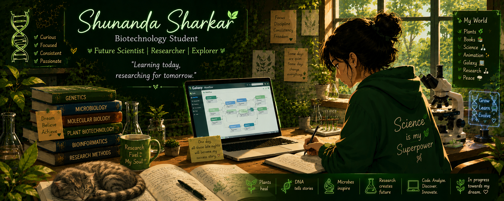
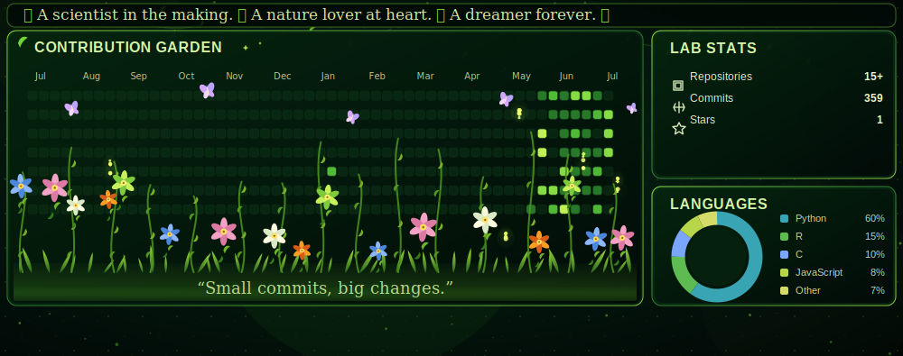

<div align="center">



<br/>

# 👋 Hello World, I'm Shunanda Sharkar

### 🧬 Biotechnology Undergraduate • Bioinformatician-in-Training • ICCR Scholar


</div>

---

## 🌟 About Me

<table>
<tr>
<td width="25%" valign="top">

### 👩‍🔬 Biography
*Deeply curious about nature, trees, and the science of life. I thrive in quiet solitude, finding my absolute focus in scientific thinking and coding. My ultimate goal is to become a research scientist in Genomics and Bioinformatics.*


- 🧬 **Evolutionary Biology Explorer** 
- 🔬 **Aspiring Research Scientist**
- 🎓 **3rd Year B.Tech Biotechnology and proud ICCR Scholar**.
- 🏥 **Medicover Hospital Intern** 
- 🌌 **Galaxy & Python Developer** 
<br/>

> *"In biology, nothing makes sense except in the light of evolution."*  
> — Theodosius Dobzhansky

</td>
<td width="15%" align="center" valign="center">


</td>
</tr>
</table>

---

## 🛠️ Skills & Technologies


<div align="center">

### 🧬 Bioinformatics


<br><br>

### 💻 Programming


<br><br>


</div>

---

## 📊 Contribution Garden & Stats

<div align="center">



</div>

---

## 🐍 Contribution Snake Game

<div align="center">


</div>

---


## 📂 Featured Projects

| 🧬 Project | 📋 Description | 🛠 Tools Used | 🔗 |
|---|---|---|---|
| **Galaxy NGS Workflow** | End-to-end next-generation sequencing pipeline built on Galaxy | Galaxy, FastQC, MultiQC | [View](https://github.com/shunandasharkarbio-boop) |
| **RNA-Seq Analysis** | Differential gene expression analysis from raw reads to results | HISAT2, DESeq2, R, Galaxy | [View](https://github.com/shunandasharkarbio-boop) |
| **Variant Calling Pipeline** | SNP & Indel detection from whole genome sequencing data | GATK, bcftools, Trimmomatic | [View](https://github.com/shunandasharkarbio-boop) |
| **FastQC & MultiQC Reports** | Automated quality control and aggregated reporting for NGS reads | FastQC, MultiQC | [View](https://github.com/shunandasharkarbio-boop) |
| **Linux for Bioinformatics** | Essential Linux commands and scripts for biological data analysis | Bash, Linux, Shell scripting | [View](https://github.com/shunandasharkarbio-boop) |

---

## 🌱 Currently Learning

```
📚 Learning Roadmap 2024–2025
├── ✅ Galaxy Workflow Development
├── ✅ FastQC & MultiQC Quality Control
├── ✅ RNA-Seq Analysis (HISAT2 + DESeq2)
├── ✅ Variant Calling (GATK pipeline)
├── 🔄 Python for Bioinformatics (Biopython, Pandas, NumPy)
├── 🔄 Linux & Bash Scripting
├── 🔄 Genome Annotation
└── 📌 Coming Next: Machine Learning in Genomics
```

---
## 🏅 Certifications & Achievements

<div align="center">

<table>
<tr>

<td align="center" width="33%">

<a href="https://github.com/shunandasharkarbio-boop/shunandasharkarbio-boop/blob/main/photo/Evolutionary%20Dynamics.jpg" target="_blank">


</a>

### 🧬 Evolutionary Dynamics

🎓 **NPTEL Elite Certified**

Study of evolution, natural selection, game theory, and population dynamics.

<br>

<a href="https://github.com/shunandasharkarbio-boop/shunandasharkarbio-boop/blob/main/photo/Evolutionary%20Dynamics.jpg">

</a>

</td>

<td align="center" width="33%">

<a href="https://github.com/shunandasharkarbio-boop/shunandasharkarbio-boop/blob/main/photo/Genetic%20engineering.jpg" target="_blank">


</a>

### 🧬 Genetic Engineering

🎓 **NPTEL Certified**

Gene cloning, recombinant DNA technology, CRISPR, and molecular biology applications.

<br>

<a href="https://github.com/shunandasharkarbio-boop/shunandasharkarbio-boop/blob/main/photo/Genetic%20engineering.jpg">

</a>

</td>

<td align="center" width="33%">

<a href="https://github.com/shunandasharkarbio-boop/shunandasharkarbio-boop/blob/main/photo/medicover%20certificte.jpg" target="_blank">


</a>

### 🏥 Laboratory Internship

**Medicover Hospitals**

🧪 **28-Day Wet Laboratory Training**

Hands-on experience in microbiology, hematology, biochemistry, and clinical diagnostics.

<br>

<a href="https://github.com/shunandasharkarbio-boop/shunandasharkarbio-boop/blob/main/photo/medicover%20certificte.jpg">

</a>

</td>

</tr>
</table>

</div>

---


### 🤝 Open to Research Collaborations | Internships | Academic Discussions

<br/>

[](https://www.linkedin.com/in/shunanda-sharkar-a52a54344/)
[](mailto:shunanda.sharkar.bio@gmail.com)
[](https://www.researchgate.net/profile/Shunanda-Sharkar)
[](https://orcid.org/0009-0008-5327-639X)

<br/>

---


*Made with ❤️ and a passion for Bioinformatics by **Shunanda Sharkar***

</div>
