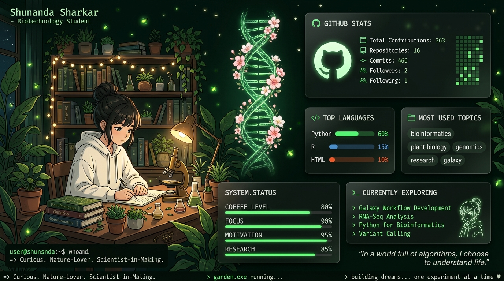

<div align="center">


<br/>

# 👋 Hello World, I'm Shunanda Sharkar

### 🧬 Biotechnology Undergraduate • Bioinformatician-in-Training • ICCR Scholar


<br/>

[](https://www.linkedin.com/in/shunanda-sharkar-a52a54344/)
[](mailto:shunanda.sharkar.bio@gmail.com)
[](https://www.researchgate.net/profile/Shunanda-Sharkar)
[](https://orcid.org/0009-0008-5327-639X)

<br/>


</div>

---

## 🌟 About Me

<div align="center">
  
</div>

<br/>

### 👩‍🔬 Biography
*Deeply curious about nature, trees, and the science of life. I thrive in quiet solitude, finding my absolute focus in scientific thinking and coding. My ultimate goal is to become a research scientist in Genomics and Bioinformatics.*

- 🌳 **Nature & Tree Lover:** Deeply connected to forests, trees, and the beauty of the natural world.
- 🧘 **Solitude & Deep Focus:** I love quiet solitude, finding my absolute peace and focus in deep scientific thinking and code.
- 🔬 **Aspiring Research Scientist:** Driven by the dream to become a research scientist in Genomics and Bioinformatics.
- 🎓 **3rd Year B.Tech Biotechnology:** Undergraduate student and proud **ICCR Scholar**.
- 🏥 **Medicover Hospital Intern:** Completed a 28-day wet lab clinical laboratory internship.
- 🌌 **Galaxy & Python Developer:** Building NGS workflows and using Python for computational biology.

<br/>

> *"In biology, nothing makes sense except in the light of evolution."*  
> — Theodosius Dobzhansky

---

## 🛠️ Skills & Technologies

### 🧬 Bioinformatics Tools
<p>
  
  
  
  
  
  
  
</p>

### 💻 Programming & Development
<p>
  
</p>

### 📊 Analysis Pipelines & Domains
<p>
  
  
  
  
  
</p>

---

## 📊 Contribution Garden & Stats

<div align="center">


</div>

---

## 🐍 Contribution Snake Game

<div align="center">


</div>

---

## 🏆 GitHub Trophies

<div align="center">


</div>

---

## 📂 Featured Projects

| 🧬 Project | 📋 Description | 🛠 Tools Used | 🔗 |
|---|---|---|---|
| **Galaxy NGS Workflow** | End-to-end next-generation sequencing pipeline built on Galaxy | Galaxy, FastQC, MultiQC | [View](https://github.com/shunandasharkarbio-boop) |
| **RNA-Seq Analysis** | Differential gene expression analysis from raw reads to results | HISAT2, DESeq2, R, Galaxy | [View](https://github.com/shunandasharkarbio-boop) |
| **Variant Calling Pipeline** | SNP & Indel detection from whole genome sequencing data | GATK, bcftools, Trimmomatic | [View](https://github.com/shunandasharkarbio-boop) |
| **FastQC & MultiQC Reports** | Automated quality control and aggregated reporting for NGS reads | FastQC, MultiQC | [View](https://github.com/shunandasharkarbio-boop) |
| **Linux for Bioinformatics** | Essential Linux commands and scripts for biological data analysis | Bash, Linux, Shell scripting | [View](https://github.com/shunandasharkarbio-boop) |

---

## 🌱 Currently Learning

```
📚 Learning Roadmap 2024–2025
├── ✅ Galaxy Workflow Development
├── ✅ FastQC & MultiQC Quality Control
├── ✅ RNA-Seq Analysis (HISAT2 + DESeq2)
├── ✅ Variant Calling (GATK pipeline)
├── 🔄 Python for Bioinformatics (Biopython, Pandas, NumPy)
├── 🔄 Linux & Bash Scripting
├── 🔄 Genome Annotation
└── 📌 Coming Next: Machine Learning in Genomics
```

---

## 🏅 Achievements & Milestones

| 🏆 Achievement | 📝 Details |
|---|---|
| 🎓 **ICCR Scholar** | Recipient of the prestigious Indian Council for Cultural Relations scholarship |
| 🏥 **Clinical Lab Internship** | 28-day wet lab internship at Medicover Hospital |
| 🌌 **Galaxy Workflow Developer** | Built complete NGS workflows on the Galaxy Bioinformatics Platform |
| 🔬 **NGS Analysis** | Hands-on experience with RNA-Seq, Variant Calling & Genome Annotation |

---


---

## 📬 Let's Connect!

<div align="center">

### 🤝 Open to Research Collaborations | Internships | Academic Discussions

<br/>

[](https://www.linkedin.com/in/shunanda-sharkar-a52a54344/)
[](mailto:shunanda.sharkar.bio@gmail.com)
[](https://www.researchgate.net/profile/Shunanda-Sharkar)
[](https://orcid.org/0009-0008-5327-639X)

<br/>

---


*Made with ❤️ and a passion for Bioinformatics by **Shunanda Sharkar***

</div>
